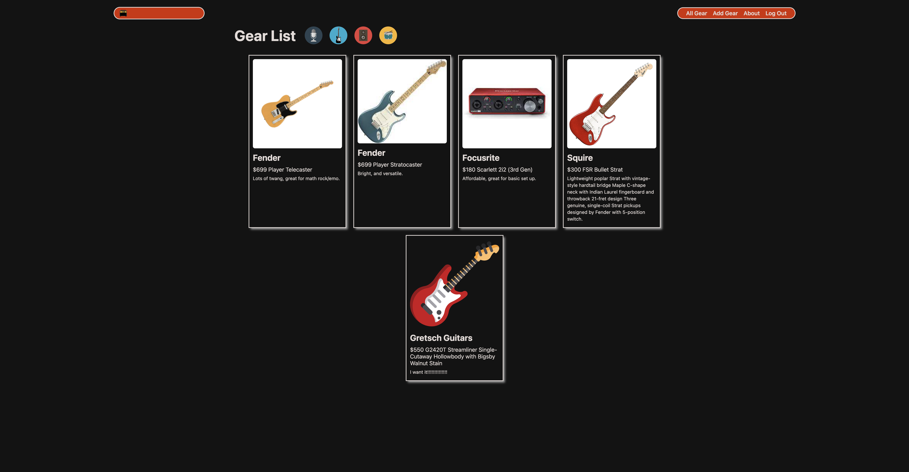

# Amped
# 

The following Python & Django application is called Amped! Amped is an application for saving and storing music equipment that you own or want to own. Upon loading, users will be taken to a landing page where they have the option to log in or sign up if they have not created an account, will then have the ability to add gear, view all of the gear that they have created, and upload a picture of the gear that they want. On the index page of the site, users will be able to click on each piece of gear that has been made and be taken to a show view of that code where they have the option to either edit the piece of gear or delete it.

## Getting Started:
The following is the link to the [app](https://jsamped.herokuapp.com/) and the link to the [Trello](https://trello.com/b/5oKBwNTm/amped).

## Technologies Used:
- 
- 
- 
- 
- 
- 
- 
- 
- 
- 
- 
- 
- 
- 
- 

## Credits:

## Next Steps: 
- AAU, I should be able to submit a url in the add gear form.